# Lab 1: Install IBM Event Streams on IBM Cloud Private
**Duration:** 1 hour

In this exercise, you install IBM Event Streams on IBM Cloud Private.

## Step 1. Access the remote lab environment.

This lab exercise is intended to run in a remote environment where IBM Cloud Private is already installed and configured. For instructor-led deliveries, the instructor provides the URL to access this environment. For self-paced virtual courses (SPVC), the URL is provided through the Digital Learning Platform (DLP). 

1. In a browser, go to the lab environment URL, and click **Run** to start the virtual machines.

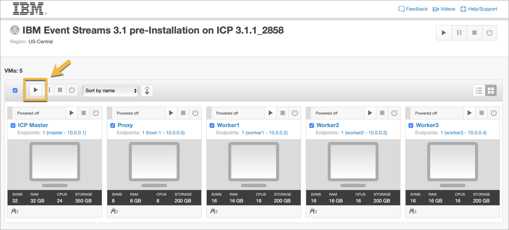

It might take a few minutes for the machines to start up. 

2. After the status changes to Running, click the image for the **ICP Master** to open the desktop.

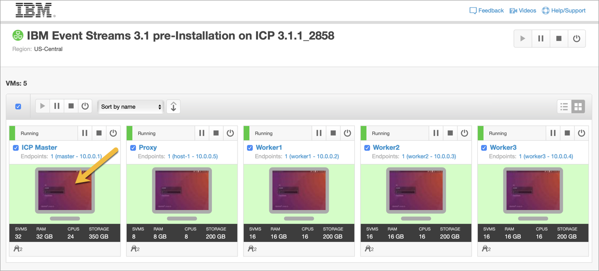

3. Log in to the Linux desktop with user ID **student**, and password **Passw0rd!**.

If you see any pop-ups about system problems being detected, or software updates, click **Cancel** to dismiss them. 

### Tips for using the remote environment

After a period of inactivity, your session is automatically suspended. You can resume your session by clicking **Run** to start the virtual machines again. It can take several minutes for all of the processes to resume, even after the status changes to Running, so if the desktop is unresponsive, wait a bit longer and try again. 

To copy and paste from your local desktop to the remote one, use the Clipboard icon in the toolbar of the remote desktop.


You can copy and paste text here to use it on the remote desktop.

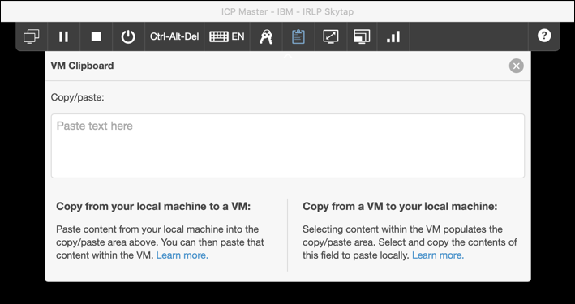

Be careful when copying and pasting text directly from certain applications. Formatting, spacing, and special characters might not be interpretted correctly.

You can also cut and paste commands from a text file that is provided on the remote desktop.


## Step 2. Download and install IBM Event Streams

NOTE: It can still take up to 20 minutes for all of the processes on the virtual machine to start up, so wait a few minutes before proceeding with the following steps.

### A. Create a namespace for Event Streams

1. Open the IBM Cloud Private console. Click the Firefox icon on the desktop to open the browser, and click the **IBM Cloud Private** bookmark on the Bookmarks toolbar.
	
 NOTE: If you see a warning about using an insecure connection, click **Advanced > Accept the risk and continue**.
	
 If you see a 502 error, wait a few minutes and try again. All the required components might need more time to start up. 
	
2. 	On the IBM Cloud Private login page, log in with the user ID **admin** and password **admin**. 

 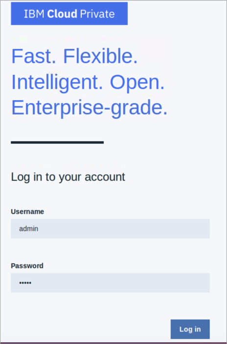

3. Click the "hamburger" icon in the upper left corner to access the menu.

 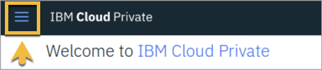

4. Select **Manage > Namespaces**. 

	To prepare for installation of IBM Event Streams, you create a namespace for it in IBM Cloud Private. 
	
5. Click **Create Namespace**, and complete the form as follows:

	* Name: **es**
	* Pod Security Policy: **ibm-restricted-psp**

6. Click **Create**. The new namespace is displayed in the list of namespaces. 

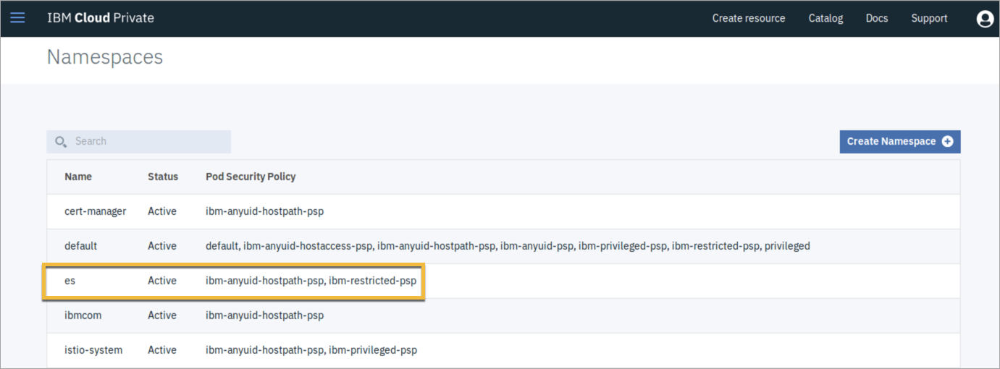

### B. Start the installation

The IBM Event Streams compressed installation file is already downloaded to the lab environment. 

1. Click the command terminal icon on the desktop to open a command terminal window.

2. Log in to the IBM Cloud Private cluster by entering the following command:

	`sudo cloudctl login -a https://10.0.0.1:8443 --skip-ssl-validation`
	
 In this case, the address of the master node is `10.0.0.1`, and the default port is `8443`. Most IBM Cloud Private commands must be run with root access, so that is why you must use `sudo`.

3. Enter the password `Passw0rd!` when prompted. 

4. 	You are prompted again for the IBM Cloud Private user ID and password. Enter `admin`, and `admin`. 	 

5. If you are prompted to select an account, accept the default.

6. When prompted to select a namespace, enter the number for the `es` namespace. In this case it is `3`.

 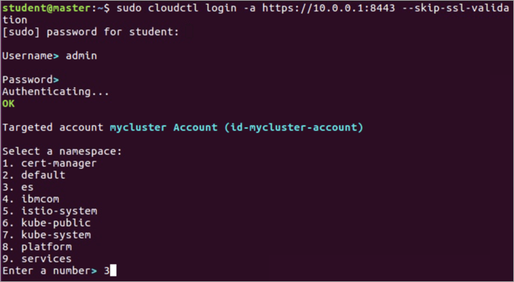

 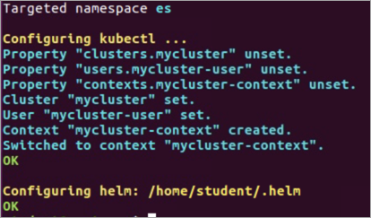
 
7. Enter the following command to log in to Docker:

	`sudo docker login mycluster.icp:8500`
	
 In this example, `mycluster.ICP:8500` is the address and port for Docker on the IBM Cloud Private cluster. 
	
8. You are prompted again for the IBM Cloud Private user ID and password. Enter `admin`, and `admin`. 	

9. Change to `/home/student/Downloads` and display the contents:

 ```
cd Downloads
ls
```
 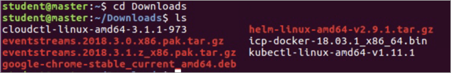	
 
 The IBM Event Streams compressed installation file is `eventstreams.2018.3.1.z_x86.pak.tar.gz`.
	
10. Load the Event Streams Helm chart in to the IBM Cloud Private Catalog by entering the following command:	

	`sudo cloudctl catalog load-archive --archive eventstreams.2018.3.1.z_x86.pak.tar.gz`

 NOTE: If you are prompted for a password, enter `Passw0rd!`. The process might take several minutes to complete.
 
After the installation completes, the catalog is updated with the IBM Event
Streams local chart, and the internal Docker repository is populated with the Docker images that IBM Event Streams uses. 

## Step 3. Verify the installation

1. Return to the IBM Cloud Private Console and click Catalog in the upper right corner.

 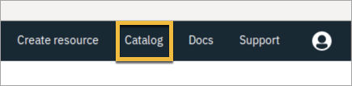	
 
2. In the search bar, enter **eventstreams**. 

3. Verify that **ibm-eventstreams-prod** is now listed in the catalog. Note that **ibm-eventstreams-dev** comes with IBM Cloud Private, and is already included in the catalog. If you see **ibm-eventstreams-prod**, the installation was successful.

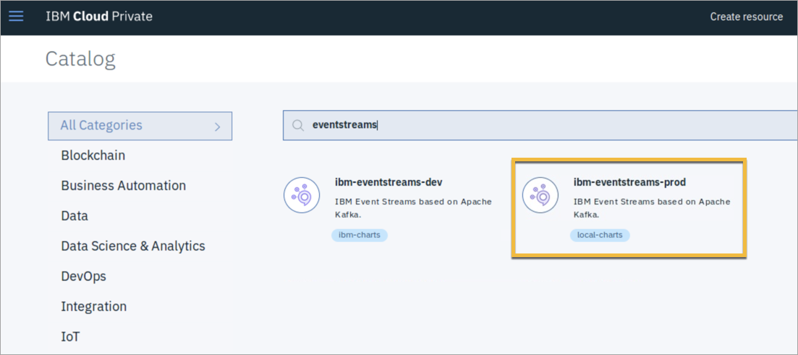	

## Step 4. Verify Event Streams prerequisites

1. Create an image pull secret for the `es` namespace by entering the following command (use your own email address in place of the one used in this command):

	`sudo kubectl create secret docker-registry regcred --docker-server=mycluster.icp:8500 --docker-username=admin --docker-password=admin --docker-email=john.smith@ibm.com -n es`

	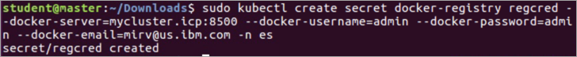

	This secret provides access to the IBM Cloud Private internal docker repository. In this example, `regcred` is the name of the secret. 
	
2. Create an image policy for the internal Docker repository. Enter the following command to create a YAML file to contain this policy:

	`gedit /home/student/Downloads/imgpol.yaml`
	
	In this example, the file is named `imgpol.yaml`. 
	
3. In the editor, enter the following contents for the file:

 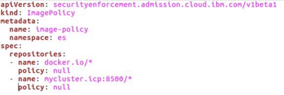

 NOTE: The spacing is very important here. Make sure that `apiVersion`, `kind`, `metadata`, and `spec` are aligned left, the first level of indented lines are preceded by two spaces, and the second level of indented lines are preceded by four spaces.
 
4. Save the file and close the editor.

5. Apply the image policy that you just created by entering the following command:

	`sudo kubectl apply -f imgpol.yaml`
	
	If you are prompted for a password, enter `Passw0rd!`.
	
### End of exercise
