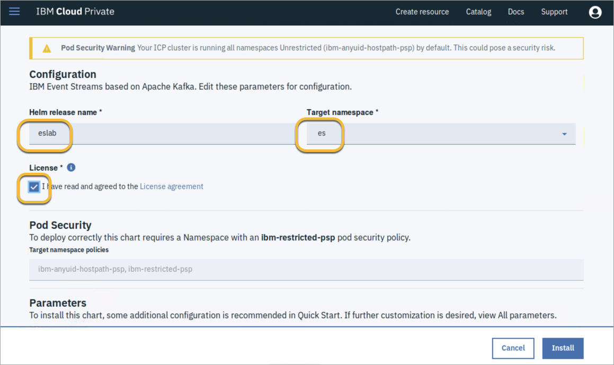
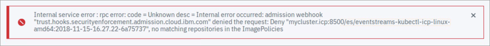

<!--June 2019 Edition

**Notices**
This information was developed for products and services offered in the US.
IBM may not offer the products, services, or features discussed in this document in other countries. Consult your local IBM representative for information on the products and services currently available in your area. Any reference to an IBM product, program, or service is not intended to state or imply that only that IBM product, program, or service may be used. Any functionally equivalent product, program, or service that does not infringe any IBM intellectual property right may be used instead. However, it is the user's responsibility to evaluate and verify the operation of any non-IBM product, program, or service.
IBM may have patents or pending patent applications covering subject matter described in this document. The furnishing of this document does not grant you any license to these patents. You can send license inquiries, in writing, to:
IBM Director of Licensing IBM Corporation
North Castle Drive, MD-NC119 Armonk, NY 10504-1785
United States of America
INTERNATIONAL BUSINESS MACHINES CORPORATION PROVIDES THIS PUBLICATION "AS IS" WITHOUT WARRANTY OF ANY KIND, EITHER EXPRESS OR IMPLIED, INCLUDING, BUT NOT LIMITED TO, THE IMPLIED WARRANTIES OF
NON-INFRINGEMENT, MERCHANTABILITY OR FITNESS FOR A PARTICULAR PURPOSE. Some jurisdictions do not allow disclaimer of express or implied warranties in certain transactions, therefore, this statement may not apply to you.
This information could include technical inaccuracies or typographical errors. Changes are periodically made to the information herein; these changes will be incorporated in new editions of the publication. IBM may make improvements and/or changes in the product(s) and/or the program(s) described in this publication at any time without notice.
Any references in this information to non-IBM websites are provided for convenience only and do not in any manner serve as an endorsement of those websites. The materials at those websites are not part of the materials for this IBM product and use of those websites is at your own risk.
IBM may use or distribute any of the information you provide in any way it believes appropriate without incurring any obligation to you.
Information concerning non-IBM products was obtained from the suppliers of those products, their published announcements or other publicly available sources. IBM has not tested those products and cannot confirm the accuracy of performance, compatibility or any other claims related to non-IBM products. Questions on the capabilities of non-IBM products should be addressed to the suppliers of those products.
This information contains examples of data and reports used in daily business operations. To illustrate them as completely as possible, the examples include the names of individuals, companies, brands, and products. All of these names are fictitious and any similarity to actual people or business enterprises is entirely coincidental.
**Trademarks**
IBM, the IBM logo, and ibm.com are trademarks or registered trademarks of International Business Machines Corp., registered in many jurisdictions worldwide. Other product and service names might be trademarks of IBM or other companies. A current list of IBM trademarks is available on the web at “Copyright and trademark information” at www.ibm.com/legal/copytrade.shtml.
**© Copyright International Business Machines Corporation 2019.
This document may not be reproduced in whole or in part without the prior written permission of IBM.**
US Government Users Restricted Rights - Use, duplication or disclosure restricted by GSA ADP Schedule Contract with IBM Corp.
-->
<!--Trademarks
The reader should recognize that the following terms, which appear in the content of this training document, are official trademarks of IBM or other companies:
IBM, the IBM logo, and ibm.com are trademarks or registered trademarks of International Business Machines Corp., registered in many jurisdictions worldwide.
The following are trademarks of International Business Machines Corporation, registered in many jurisdictions worldwide:
IBM Cloud™
z/OS®
Java™ and all Java-based trademarks and logos are trademarks or registered trademarks of Oracle and/or its affiliates.
VMware is a registered trademark or trademark of VMware, Inc. or its subsidiaries in the United States and/or other jurisdictions.
Other product and service names might be trademarks of IBM or other companies.-->
# Lab 2: Configure and test IBM Event Streams on IBM Cloud Private
**Duration:** 1 hour

In this exercise, you create an instance of IBM Event Streams and test its operation by using a sample application that is generated from Event Streams.

You must complete Lab 1 before proceeding with this exercise. 

## Step 1. Install the Event Streams Helm chart

You can install a Helm chart by using a command-line interface (CLI), or by using the IBM Cloud Private Console. The instructions here describe how to use the console. 

1. On the ICP Master virtual machine image, open Firefox and click the **IBM Cloud Private** bookmark tab, or enter the following address in a browser:

	`https://mycluster.icp:8443/`
	
2. On the IBM Cloud Private login page, log in with the user ID **admin** and password **admin**. 

3. Click the "hamburger" icon in the upper left corner to access the menu, and select **Manage > Helm Repositories**. 

4. Click **Sync repositories** to make sure that the Helm charts are up to date, and then click **OK** to confirm.

 

 This process might take several minutes to complete.
	
5. After synchronization is complete, click **Catalog** to display the list of Helm charts. 

6. Click the **Integration** category, and then click **ibm-evenstreams-prod**.

 

7. Review all of the configurable options that are available for Event Streams, and then click **Configure**.

 

8. Enter **eslab** for the Helm release name and then select **es** from the Target namespace drop-down menu. Also, select the license agreement checkbox.

 
 
 If you see a **Pod Security Warning**, you can ignore it for this lab exercise.  

9. Scroll down and expand the **Quick start** section. Enter **regcred** for the Image pull secret.

 

10. Expand the **All parameters** section, and make sure that the value for Docker image registry is **mycluster.icp:8500/es**. The address must not contain a trailing forward slash. If it does, delete the slash (there is a typo in the Helm chart, which will be corrected in a future release).

11. You can accept the remaining default values. Click **Install** to start the installation.

 

 This process might take several minutes to complete. 
	
 
 
 NOTE: If you see an error like the following:
 
 
 
 The issue might be the `imgpol.yaml` file that you created in the previous exercise. Make sure there are no typos, and the spacing is correct in the file. Run the command to apply the changes, and then try clicking **Install** again. 
	
12. You can check the status of the deployment by selecting **Workloads > Deployments** from the console menu. Select **es** from the drop-down menu in the upper right corner. 
	
 

 Six items are listed. When the **Desired**, **Current**, **Ready** and **Available** columns all display the same value in each row (except for **eslab-ibm-es-replicator-deploy**, which has a Desired value of **0**), Event Streams is ready. 

	
## Step 2. Explore the Event Streams console

1. From the hamburger menu, select **Workload > Helm Releases**. 

2. Click the **eslab** release to view all of the assets that are deployed. Note that there are several IBM Cloud Private assets included in the release.

 

3. To access the Event Streams admin console, click **Launch** in the upper right corner, and then select **admin-ui-https**.

 

 NOTE: If you see a warning about using an insecure connection, click **Advanced > Accept the risk and continue**.
 
 If you see a login screen, enter **admin** and **admin**. 
 
 If you see an OAuth error, you must launch the admin console by using the **eslab-ibm-es-ui-svc** Service to continue. In the Service section, click **eslab-ibm-es-ui-svc**, and then click the link next to **Node port**. The console opens in a new browser tab. 

4. Review the contents of the Welcome page. Note the System health indicator in the lower right corner of the page. Click it to expand a list of components that are running in the Event Streams Deployment. Click the **X** to close it. 

 


## Step 3. View Event Streams Topics

Event Streams applications write to or read from Topics. A *Topic* is a group of related data that applications either produce or consume. The Event Streams administrator creates and configures Topics. Applications connect to Topics. 

The Event Streams Deployment includes a sample Topic that you can use to explore and learn about Event Streams operations. 

1. In the Event Streams console, click **Use a simulated topic**. 

 
 
2. On the Topics page, click **IBM\_simulation\_Topic**.

  

3. The view opens at the **Messages** tab for the selected Topic. Note that a calendar widget and a table that contains a list of sample messages, their associated partition, and offset, is displayed. Take a moment to explore each of the tabs along the top of this page.

 

4. Click Topics in the upper left corner to return to the Topics view. 

## Step 4. Create and test a Topic

1. On the Topics page, click **Create Topic**.

2. Enter **eslab** for the Topic name.

 

3. Click **Advanced** to expand and review the configuration parameters that are available. Click **Advanced** again to close that section, and then click **Next** to proceed through the remaining options. Accept the default settings on each page, and then click **Create Topic**.

 
 
4. In the Topics view, click **eslab**.

5. Click **Connect to this Topic**.

 
 
6. Review the options on this page, and note the bootstrap server address and port. You use this information in a later exercise. Then, click the **X** to close it, and click the arrow to go back to Topics.

 
 
7. Event Streams has several tools that can be used for development and testing of Event Streams applications. Click the **Toolbox** tab to access these tools.

8. Click **Generate application**.

 

9. Enter **eslabtester** for the Application name, and select the **eslab** Topic. Accept the default settings to produce and consume messages, and then click **Generate**.

 

10. After the starter application is generated, click **Download** and save the archive file to the Downloads directory.

 

 

11. In a command terminal, run the following commands to extract the starter application:

 ```
cd Downloads
unzip IBMEventStreams_eslabtester.zip
```

 When prompted, enter `A` to replace files.
	
 NOTE: Java and Maven, a build tool that is used to create Java applications, are installed in the lab environment. The starter application contains a `pom.xml` file, which provides the instructions for Maven to generate the starter application.
	
12. Run the following commands to build and start the application:

 ```
export _JAVA_OPTIONS=-Djdk.net.URLClassPath.disableClassPathURLCheck=true
mvn install liberty:run-server
```
 It might take a few minutes for the process to complete. Wait until you see the message, "The server defaultServer is ready to run a smarter planet" before you proceed to the next step.
	
13. In a new browser tab, enter the following URL:

	`http://localhost:9080/elabtester`
	
	The Starter Application screen is split, with a producer on the left and a consumer on the right. Note that the consumer already started to listen for messages.
	
 
	
14. Enter a message, for example, "Hello World," in the Custom payload field and click **Run**. 

 

 The producer begins producing messages, which are sent to the Topic. On the consumer side, the number of messages increments, while the message list becomes populated. 
	
 
	
15. Click a message in the list to see more details about it. Click the **X** in the upper right corner to hide the details.

 

16. To stop producing messages, click **Run** again. 

17. You can leave the application running in the terminal window because you use it again in a later lab exercise, but if you need to stop it, press Ctrl-C in the window. You can start it again later by running the `export` and `mvn` commands from a previous step in this section. 

### End of exercise
	
