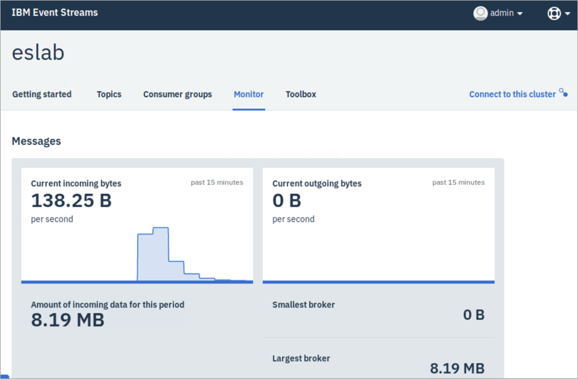

# Lab 3: Work with a load-producing application on Event Streams
**Duration:** 30 minutes

In this exercise, you install another sample application that you can use to generate workloads of a specific size. You can use one of the predefined load sizes, or you can specify your own settings to test throughput.

You must complete Labs 1-2 before proceeding with this lab.

## Step 1. Install and configure the workload producer application

1. On the ICP Master virtual machine image, open Firefox and click the **IBM Cloud Private** bookmark tab, or enter the following address in a browser:

	`https://mycluster.icp:8443/`
	
2. On the IBM Cloud Private login page, log in with the user ID **admin** and password **admin**. 

3. From the hamburger menu, select **Workload > Helm Releases > eslab**.

4. Click **Launch** in the upper right corner, and then select **admin-ui-https**.

 

5. Log in with the user ID **admin** and password **admin**. 

6. Click the **Toolbox** tab to access tools.

7. Click **View on GitHub** in the Workload generation application. 

 
 
8. GitHub opens in a new browser tab. Scroll down to the README.md page and click **here**.

 

9. Under **Latest Release**, click **es-producer.jar** to download it to /home/student/Downloads. 

 
 
 Select **Save file**, and click **OK**. 
 
10. In a command terminal window, change to the Downloads directory (`cd Downloads`) and run the following command:

 `java -jar es-producer.jar -g`
 
 
 
 This command creates the configuration file, `producer.config`.

11. Run the following command to open this file in an editor:

 `gedit producer.config`
 
 You must add some information to this file that you can find in the Event Streams console. 
 
12. In the Event Streams console, click the **Topics** tab, and then click **eslab**. 

 

13. Click **Connect to this topic**.

 
 
14. Copy the **Bootstrap server** address.

 

15. Paste this address in to the editor as the value for `bootstrap.servers`.

 

16. Go back to the **Topic connection** page and, under **Certificates**, click the icon to download the **Java truststore**.

 

17. Choose **Save file**, and then enter the full pathname of the file in to the editor as the value for `ssl.truststore.location`. 

 

 In this case, the pathname is `/home/student/Downloads/es-cert.jks`.
 
18. Back on the Topic connection page, under **API key**, enter **es-producer** for the application name, and click **Produce only.**

 

19. Click **Generate API key**.

 

20. Click the icon to copy the API key.

 

21. Paste the API key in to the editor as the value for password. Paste between the double quotations marks.

 

22. Save and close the `producer.config` file.

23. In the Event Streams console, click the **X** on the Topic connection page to close it. 

## Step 2. Run the application with load

1. In a command terminal window, in the directory where you saved the es-producer.jar file (/home/student/Downloads), run the following command:

 `java -jar es-producer.jar -t eslab -s small`
 
 This command specifies `eslab` for the Topic, and a predefined `small` size load. 
 
 The output scrolls by very quickly, and then concludes with a message that reports the number of messages sent and some details about performance. 
 
 
 
2. Go back to the Event Streams console and click the **Monitor** tab.

 

 Here you see some metrics for the small load. Scroll down to see all the information that is available. The data refreshes every few seconds. You learn more about monitoring later in this course. 
 
3. Run the test again, but this time with a larger load. In a command terminal window, run the following command:

 `java -jar es-producer.jar -t eslab -s large`
 
4. Go back to the **Monitor** tab in the Event Streams console and notice what happens while the test runs. Notice the differences between running the small load and the large load. 

 If you want, you can also go back to the previous lab and run the starter application (consumer) again, and monitor the results in the console. 
 
 
### End of exercise
<!--June 2019 Edition

**Notices**

This information was developed for products and services offered in the US.
IBM may not offer the products, services, or features discussed in this document in other countries. Consult your local IBM representative for information on the products and services currently available in your area. Any reference to an IBM product, program, or service is not intended to state or imply that only that IBM product, program, or service may be used. Any functionally equivalent product, program, or service that does not infringe any IBM intellectual property right may be used instead. However, it is the user's responsibility to evaluate and verify the operation of any non-IBM product, program, or service.
IBM may have patents or pending patent applications covering subject matter described in this document. The furnishing of this document does not grant you any license to these patents. You can send license inquiries, in writing, to:
IBM Director of Licensing IBM Corporation
North Castle Drive, MD-NC119 Armonk, NY 10504-1785
United States of America
INTERNATIONAL BUSINESS MACHINES CORPORATION PROVIDES THIS PUBLICATION "AS IS" WITHOUT WARRANTY OF ANY KIND, EITHER EXPRESS OR IMPLIED, INCLUDING, BUT NOT LIMITED TO, THE IMPLIED WARRANTIES OF
NON-INFRINGEMENT, MERCHANTABILITY OR FITNESS FOR A PARTICULAR PURPOSE. Some jurisdictions do not allow disclaimer of express or implied warranties in certain transactions, therefore, this statement may not apply to you.
This information could include technical inaccuracies or typographical errors. Changes are periodically made to the information herein; these changes will be incorporated in new editions of the publication. IBM may make improvements and/or changes in the product(s) and/or the program(s) described in this publication at any time without notice.
Any references in this information to non-IBM websites are provided for convenience only and do not in any manner serve as an endorsement of those websites. The materials at those websites are not part of the materials for this IBM product and use of those websites is at your own risk.
IBM may use or distribute any of the information you provide in any way it believes appropriate without incurring any obligation to you.
Information concerning non-IBM products was obtained from the suppliers of those products, their published announcements or other publicly available sources. IBM has not tested those products and cannot confirm the accuracy of performance, compatibility or any other claims related to non-IBM products. Questions on the capabilities of non-IBM products should be addressed to the suppliers of those products.
This information contains examples of data and reports used in daily business operations. To illustrate them as completely as possible, the examples include the names of individuals, companies, brands, and products. All of these names are fictitious and any similarity to actual people or business enterprises is entirely coincidental.
**Trademarks**
IBM, the IBM logo, and ibm.com are trademarks or registered trademarks of International Business Machines Corp., registered in many jurisdictions worldwide. Other product and service names might be trademarks of IBM or other companies. A current list of IBM trademarks is available on the web at “Copyright and trademark information” at www.ibm.com/legal/copytrade.shtml.
**© Copyright International Business Machines Corporation 2019.
This document may not be reproduced in whole or in part without the prior written permission of IBM.**
US Government Users Restricted Rights - Use, duplication or disclosure restricted by GSA ADP Schedule Contract with IBM Corp.

**Trademarks**

The reader should recognize that the following terms, which appear in the content of this training document, are official trademarks of IBM or other companies:
IBM, the IBM logo, and ibm.com are trademarks or registered trademarks of International Business Machines Corp., registered in many jurisdictions worldwide.
The following are trademarks of International Business Machines Corporation, registered in many jurisdictions worldwide:
IBM Cloud™
z/OS®
Java™ and all Java-based trademarks and logos are trademarks or registered trademarks of Oracle and/or its affiliates.
VMware is a registered trademark or trademark of VMware, Inc. or its subsidiaries in the United States and/or other jurisdictions.
Other product and service names might be trademarks of IBM or other companies.-->
