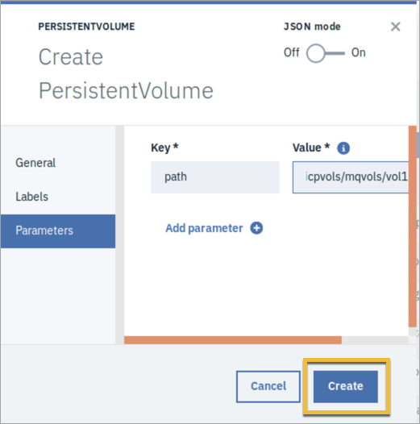
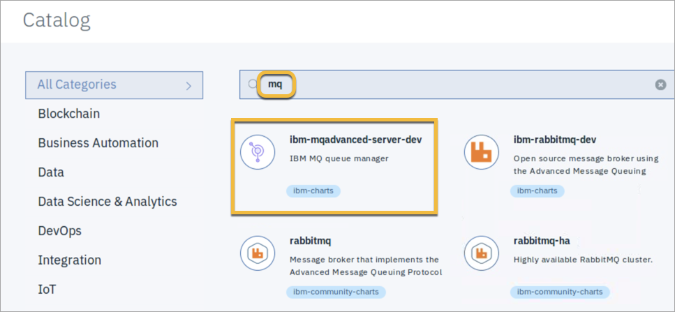
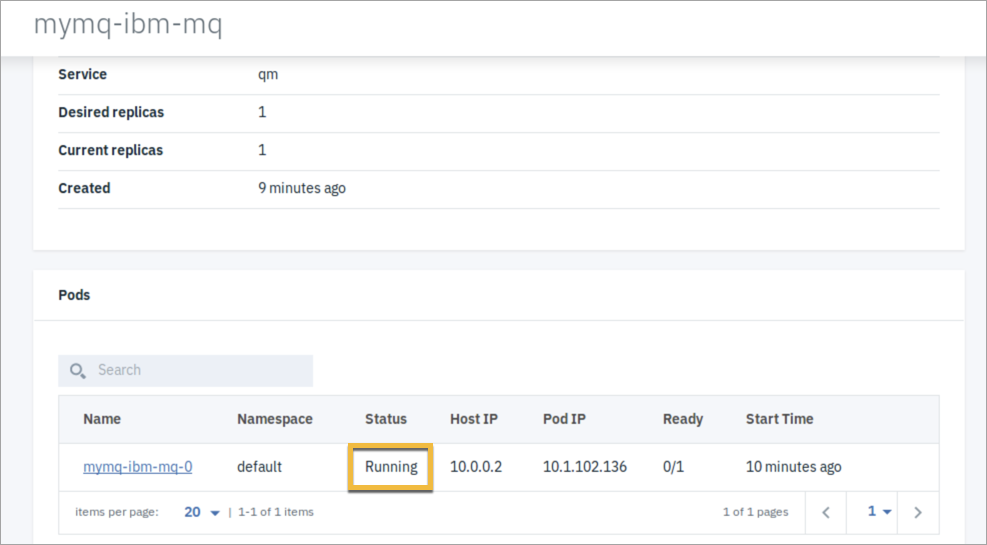
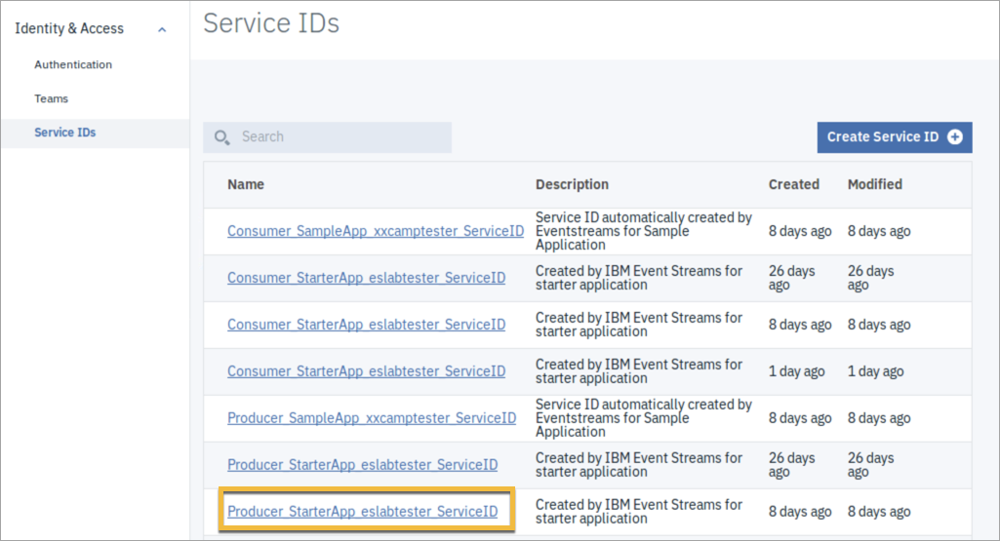

<!--June 2019 Edition

**Notices**
This information was developed for products and services offered in the US.
IBM may not offer the products, services, or features discussed in this document in other countries. Consult your local IBM representative for information on the products and services currently available in your area. Any reference to an IBM product, program, or service is not intended to state or imply that only that IBM product, program, or service may be used. Any functionally equivalent product, program, or service that does not infringe any IBM intellectual property right may be used instead. However, it is the user's responsibility to evaluate and verify the operation of any non-IBM product, program, or service.
IBM may have patents or pending patent applications covering subject matter described in this document. The furnishing of this document does not grant you any license to these patents. You can send license inquiries, in writing, to:
IBM Director of Licensing IBM Corporation
North Castle Drive, MD-NC119 Armonk, NY 10504-1785
United States of America
INTERNATIONAL BUSINESS MACHINES CORPORATION PROVIDES THIS PUBLICATION "AS IS" WITHOUT WARRANTY OF ANY KIND, EITHER EXPRESS OR IMPLIED, INCLUDING, BUT NOT LIMITED TO, THE IMPLIED WARRANTIES OF
NON-INFRINGEMENT, MERCHANTABILITY OR FITNESS FOR A PARTICULAR PURPOSE. Some jurisdictions do not allow disclaimer of express or implied warranties in certain transactions, therefore, this statement may not apply to you.
This information could include technical inaccuracies or typographical errors. Changes are periodically made to the information herein; these changes will be incorporated in new editions of the publication. IBM may make improvements and/or changes in the product(s) and/or the program(s) described in this publication at any time without notice.
Any references in this information to non-IBM websites are provided for convenience only and do not in any manner serve as an endorsement of those websites. The materials at those websites are not part of the materials for this IBM product and use of those websites is at your own risk.
IBM may use or distribute any of the information you provide in any way it believes appropriate without incurring any obligation to you.
Information concerning non-IBM products was obtained from the suppliers of those products, their published announcements or other publicly available sources. IBM has not tested those products and cannot confirm the accuracy of performance, compatibility or any other claims related to non-IBM products. Questions on the capabilities of non-IBM products should be addressed to the suppliers of those products.
This information contains examples of data and reports used in daily business operations. To illustrate them as completely as possible, the examples include the names of individuals, companies, brands, and products. All of these names are fictitious and any similarity to actual people or business enterprises is entirely coincidental.
**Trademarks**
IBM, the IBM logo, and ibm.com are trademarks or registered trademarks of International Business Machines Corp., registered in many jurisdictions worldwide. Other product and service names might be trademarks of IBM or other companies. A current list of IBM trademarks is available on the web at “Copyright and trademark information” at www.ibm.com/legal/copytrade.shtml.
**© Copyright International Business Machines Corporation 2019.
This document may not be reproduced in whole or in part without the prior written permission of IBM.**
US Government Users Restricted Rights - Use, duplication or disclosure restricted by GSA ADP Schedule Contract with IBM Corp.
-->
<!--Trademarks
The reader should recognize that the following terms, which appear in the content of this training document, are official trademarks of IBM or other companies:
IBM, the IBM logo, and ibm.com are trademarks or registered trademarks of International Business Machines Corp., registered in many jurisdictions worldwide.
The following are trademarks of International Business Machines Corporation, registered in many jurisdictions worldwide:
IBM Cloud™
z/OS®
Java™ and all Java-based trademarks and logos are trademarks or registered trademarks of Oracle and/or its affiliates.
VMware is a registered trademark or trademark of VMware, Inc. or its subsidiaries in the United States and/or other jurisdictions.
Other product and service names might be trademarks of IBM or other companies.-->

# Lab 4: Use the Kafka Connect source connector for IBM MQ

**Duration:** 2 hours

In this exercise, you connect IBM Event Streams to IBM MQ by using the Kafka Connect source connector for IBM MQ. You can use this source connector to copy data from MQ into Event Streams or Apache Kafka. The connector copies messages from a source MQ queue to a target Topic. 

You can also transfer messages from a Topic to an MQ queue by using a sink connector, which is covered later in this course. 

You must complete Labs 1-3 before proceeding with this lab. 

## Step 1. Install MQ in IBM Cloud Private

### A. Create a Persistent Volume (PV)

This example requires a Persistent Volume (PV) that uses ReadWriteOnce (RWO) mode to store data in IBM Cloud Private. That means that only one node can mount the PV with read/write permissions. 

1. On the ICP Master virtual machine image, open Firefox and click the **IBM Cloud Private** bookmark tab, or enter the following address in a browser:

	`https://mycluster.icp:8443/`
	
2. On the IBM Cloud Private login page, log in with the user ID **admin** and password **admin**. 

3. From the hamburger menu, select **Platform > Storage**.

4. Click **Create PersistentVolume**.

 

 In this example, you create a PV by using the host path file system. 
 
5. Complete the **General** section as follows:

 * Name: **mqvol**
 * Capacity: **2 GB**
 * Storage type: **Host path**

 
 
 

 NOTE: Host path is used for the purpose of this lab exercise, but it is not recommended for production environments. Other storage options are available, and you can find more information in the IBM Cloud Private Knowledge Center. 
 
6. Click **Parameters** and complete the form as follows:

 * Key: **path**
 * Value: **/home/student/icpvols/mqvols/vol1**

7. Click **Create**.

 

 The PV now appears in the list. 
 
 
 
8. Verify creation of the host path **/home/student/icpvols/mqvols/vol1**. 

### B. Install the MQ Helm chart

1. In the IBM Cloud Private console, select **Manage > Helm Repositories** from the menu.

2. Click **Sync repositories** to make sure that the Helm charts are up to date, and then click **OK** to confirm.

3. After synchronization is complete, click **Catalog** to display the list of Helm charts. 

4. Search for **mq**, and select **ibm-mqadvanced-server-dev**.

 

5. Click **Configure** and complete the form as follows:

 * Helm release name: **mymq**
 * Target namespace: **default**
 * Select the License checkbox

 
 
6. Expand the **Parameters** section, scroll down to Service, and select NodePort for the Service type.

 
 
7. Under **Security**, select the checkbox to **Initialize volume as root**.

 

8. Scroll down to **Queue manager** and enter **QM1** for the Queue manager name, and **admin** for the password. 

 

9. Accept the remaining default values and click **Install**.

10. Click **View Helm release** to view the progress.

 

 The status changes to **Deployed**, and the pod status changes to **Running** when MQ is ready. 
 
 

11. Scroll down to the **Service** section, and you see the NodePort service listed there with its address and port information. 

 

12. Under **StatefulSet** click the StatefulSet listed there to view its status.

 

13. Scroll down to **Pods** and note the **Status**.

 

 NOTE: You can use the pod name listed here to refer to this resource in the command-line interface (after you configure the `kubectl` client). For example,
 
 `sudo kubectl describe po mymq-ibm-mq-0`
 
 You can find more details about using `kubectl` in the [IBM Cloud Private Knowledge Center](https://www.ibm.com/support/knowledgecenter/SSBS6K/product_welcome_cloud_private.html), and in the [Kubernetes documentation](https://kubernetes.io/docs/home/). 
 
### C. Open the MQ console
 
1. In the IBM Cloud Private console, go to **Network Access > Services**.

2. Click the **mymq-ibm-mq** service.

 

 Links for the MQ console and MQ traffic (listener) display next to **NodePort**. Your ports might differ from those displayed here. Make a note of the MQ listener port for future reference. 
 
3. Click the link for the MQ console.

 
 
 NOTE: If you see warnings about using an insecure connection, click **Advanced > Accept the risk and continue**.
 
4. Log in to the console with user ID **admin** and password **admin**.

 The Queue Manager displays a status of **Running**.
 
 

Some queues and channels are created for you by default, and the default security settings are sufficient for this lab exercise. 

## Step 2. Install the connector

### A. Download connector files

1. Open the Event Streams console.

 HINT: To access the Event Streams admin console, in the IBM Cloud Private console, select **Workloads > Helm Releases** from the console menu, click **eslab**, and then click **Launch** in the upper right corner, and select **admin-ui-https**.
 
2. Click **Toolbox** and scroll down to **Connectors**.

3. Under **Kafka Connect source connector for IBM MQ**, click **Find out more**.

 

4. Click the links to download the **Connector JAR** and **Sample connector properties** file, and click **Save file**.

 
 
 NOTE: You can also obtain the connector from [GitHub](https://github.com/ibm-messaging/kafka-connect-mq-source) if you want to build it yourself. 

5. Copy the files into `/home/student`.

 NOTE: The connector runs inside a Java process called a worker. It can run in either standalone or distributed mode. Standalone mode is intended for testing, and temporary connections between systems. Distributed mode is appropriate for production use. In this lab exercise, you use standalone mode. 
 
 With a standalone worker, there are two configuration files:
  * The worker configuration file contains the properties that are required to connect to Kafka. 
  * The connector configuration file contains the properties that are used by the connector, so that is where the MQ configuration goes.
 
 The simplest scenario is to run only one connecter per standalone worker. A worker sends out a lot of messages, and they are easier to read for just one connector, rather than having to distinguish messages for multiple connectors. 
 
### B. Install Kafka locally

In this part of the exercise, you install a local copy of Kafka before moving on to Event Streams. 

1. In a browser, go to the Apache Kafka download site:

 `http://kafka.apache.org/downloads`
 
2. Under **Binary downloads**, click the link for the latest supported version of Scala.

 

 Your screen might look different than the image shown here. 
 
 If the web site suggests a mirror site for the download, click one of the recommended links, and then click **Save file**.
 
3. In a command terminal window, run the following command to unpack the compressed file:

  `tar -zxvf ~/Downloads/kafka_<version>.tgz`
 
 NOTE: Be sure to substitute your version for `<version>` in the command. The version used in this course is 2.12-2.2.0, but yours might be different.
  
 The command creates the Kafka root directory, which contains a `bin` directory for the Kafka executable files, and a `config` directory for the configuration files. Feel free to explore the Kafka directory structure. 
 
  

4. Change to `/home/student` and open the `mq-source.properties` file in an editor:

 ```
 cd /home/student
 gedit mq-source.properties
 ```
 
5. Update the properties as follows:

 * `mq.queue.manager=QM1`
 * `mq.connection.name.list=10.0.0.1(port)`
 * `mq.channel.name=DEV.APP.SVRCONN`
 * `mq.queue=DEV.QUEUE.1`
 * `topic=eslab`

 NOTE: For the `port`, use your MQ listener port, which is displayed in the IBM Cloud Private console under **Network Access > Services > mymq-ibm-mq**.
 
   
 
 The number might be different than the ones shown here.

  
 ...
  

6. Save and close the file.

### C. Test the connector

Several components are required to run a minimal Kafka cluster, and it is recommended to run each of them in a separate command terminal window. In this exercise, you open a new command terminal window (right-click **Terminal**, and select **New Terminal**), and change to the Kafka root directory to run the command for each process that is required. You must keep all the windows open. You can minimize a window to get it out of the way by clicking the **-** (minus sign) in the upper left corner, but do not close the window, or the process will stop. 

HINT: You might want to arrange all the windows on the desktop in such a way that you can keep track of them, and tell them apart. You can change the color scheme of each window by creating different terminal profiles. Select **File > New profile** from the Terminal menu, and enter a name for the profile on the **General** tab. Click the **Colors** tab, and choose a different color scheme.

  
 
Create as many profiles as you prefer. You might have 5-6 active terminal windows in this exercise.
 
To switch profiles, select **Terminal > Change profile**, and select the profile.

  

1. In a new terminal window, change to the Kafka root directory, and start the Zookeeper server:

 ```
 cd /home/student/Downloads/kafka_<version>
 bin/zookeeper-server-start.sh config/zookeeper.properties
 ```
 NOTE: Once again, be sure to substitute your version for `<version>` in the command. The version used in this course is 2.12-2.2.0, but yours might be different.
 
2. In another new terminal window, in the Kafka root directory, run the Kafka server:

 `bin/kafka-server-start.sh config/server.properties`
 
 Wait until you see the message `INFO [KafkaServer id=0] started` before proceeding with the next step.
 
3. In another new terminal window, in the Kafka root directory, enter the following command to create a topic:

 `bin/kafka-topics.sh --zookeeper localhost:2181 --create --topic eslab --partitions 1 --replication-factor 1`
 
4. Run the following command to verify that the topic was created:

 `bin/kafka-topics.sh --zookeeper localhost:2181 --describe`
 
  
 
 The details of this single-node configuration follow:
  * Kafka bootstrap server: `localhost:9092`
  * ZooKeeper server: `localhost:2181`
  * Topic name: `eslab`
  * Kafka writes data to `/tmp/kafka-logs`
  * Zookeeper uses `/tmp/zookeeper`
  * Kafka Connect uses `/tmp/connect.offsets`

5. In another new terminal window, in the Kafka root directory, run the following command to start the connector:

 `CLASSPATH=/home/student/kafka-connect-mq-source-1.0.1-jar-with-dependencies.jar bin/connect-standalone.sh config/connect-standalone.properties ~/mq-source.properties`
 
 This process is the Kafka Connect worker. Two messages in the output indicate that the connector is running properly: "Connection to MQ established," and "Polling for records."
 
  
 
6. In another new terminal window, in the Kafka root directory, run the following command to start the consumer:

 `bin/kafka-console-consumer.sh --bootstrap-server localhost:9092 --topic eslab`
 
 You will not see any message output in this window until the consumer starts to consume messages. 
 
7. In the MQ console, under Queues, select **DEV.QUEUE.1** and click the button to "Put message."

  

8. Enter a test message, and click **Put**. 

  
 
 Now you see the message in the terminal window that is running the consumer.

  

 The local Kafka instance successfully consumed the message that you published from MQ. 

9. In the terminal window that is running the consumer, press Ctrl-C. 

 The process ends, and displays a message indicating the number of messages that were processed. 
 
 Now you can stop the Kafka processes. 
 
10. In the terminal window that is running the Kafka Connect worker, press Ctrl-C. 

11. In any terminal window that is not otherwise busy, in the Kafka root directory, enter the following commands to stop the Kafka server, and then stop Zookeeper:

 ```
 bin/kafka-server-stop.sh
 bin/zookeeper-server-stop.sh
 ```

12. Close the extra terminal windows.

## Step 3. Test the connector with Event Streams

You can use an existing MQ or Kafka installation, either locally or in the cloud. For performance reasons, it is recommended to run the Kafka Connect worker close to the MQ queue manager to minimize the effect of
network latency. So, if you have a queue manager in a datacenter and Kafka in the cloud, it is best to run the Kafka Connect worker in the datacenter.

In this part of the exercise, you use the existing local Kafka cluster, and specify connection details in the Kafka Connect worker configuration file. You need to have the following information on hand:

  * A list of one or more servers for bootstrapping connections
  * Cluster connection reqjuirements (SSL or TLS)
  * Authentication credentials, if required

You also run the Kafka Connect worker as you did previously. 

### A. Create API keys for the producer and consumer
Create API keys, one each for the consumer and producer. In this example, Kafka Connect uses the producer key, and the console consumer uses the consumer key. 

1. In the IBM Cloud Private console menu, select **Manage > Identity & Access**, and click **Service IDs**.

2. Click **Producer\_StarterApp\_eslabtester\_ServiceID**.

  
 
 If there are multiple instances of the service ID listed, click the latest one. 

3. Click **API Keys**, then **Create API Key**.

  
 
4. Enter **producer** for the name, and click **Create**.

  
 
5. Click **Download**, and then **Save file**. 

  
 
 The file is named **apikey.json**, by default. 

6. In a command terminal, run the following commands to change the name to `producer.json`:

 ```
 cd Downloads
 mv apikey.json producer.json
 ```
 
7. Repeat the above steps to create an API key for **Consumer\_StarterApp\_eslabtester\_ServiceID**. Name the key **consumer**, and rename the key file  `consumer.json`.  If there are multiple instances of the service ID listed, click the latest one. 

### B. Update the configuration file

1. In the Kafka root `config` directory, make a copy of the `connect-standalone.properties` file, and name it `connect-standalone-es.properties`.

 ```
 cd /home/student/Downloads/kafka_2.12-2.2.0/config
 gedit connect-standalone.properties
 ```
 
2. In the text editor menu, select **File > Save As**, edit the name of the file, and click **Save**.

  

3. Edit the `connect-standalone-es.properties` file. Add the following stanzas:

 ```
security.protocol=SASL_SSL
ssl.protocol=TLSv1.2
ssl.endpoint.identification.algorithm=
ssl.truststore.location=
ssl.truststore.password=password
sasl.mechanism=PLAIN
sasl.jaas.config=org.apache.kafka.common.security.plain.PlainLoginModule required username="token" password="";
```
 ```producer.security.protocol=SASL_SSL
producer.ssl.protocol=TLSv1.2
producer.ssl.endpoint.identification.algorithm=
producer.ssl.truststore.location=
producer.ssl.truststore.password=password
producer.sasl.mechanism=PLAIN
producer.sasl.jaas.config=org.apache.kafka.common.security.plain.PlainLoginModule required username="token" password="";
```
 Update values as follows:
 
  * `bootstrap.servers`: the Event Streams bootstrap server (IP address and port number)
  * `ssl.truststore.location`: the location of the truststore JKS file that you downloaded in a previous exercise (`/home/student/Downloads/es-cert.jks`)
  * `ssl.truststore.password`: `password`
  * `sasl.jaas.config` `password`: the producer API key that you just created
  * `producer.ssl.truststore.location`: the location of the truststore JKS file that you downloaded in a previous exercise (`/home/student/Downloads/es-cert.jks`)
  * `producer.ssl.truststore.password`: `password`
  * `producer.sasl.jaas.config` `password`: the producer API key that you just created

 HINT: To find the Event Streams bootstrap server address, in the Event Streams console, click the **Topics** tab, and then click **eslab**. Click **Connect to this topic**, and copy the **Bootstrap server** address and port number. In this example, it is `10.0.0.5:32307`. Be sure to substitute this value with your own bootstrap server address and port. 
 
 Copy the API key from the `producer.json` file, and paste it between the double quotes for the `sasl.jaas.config` and `producer.sasl.jaas.config` passwords. The file should look similar to this:
 
   
 
4. Save and close the file. Note that the MQ properties do not need to be updated in this case. 

### C. Test the connector by using the Starter application

1. In a command terminal, in the Kafka root directory, enter the following command to start the connector:

 `CLASSPATH=/home/student/kafka-connect-mq-source-1.0.1-jar-with-dependencies.jar bin/connect-standalone.sh config/connect-standalone-es.properties ~/mq-source.properties`

 Look for the two messages in the output that indicate the connector is running properly: "Connection to MQ established," and "Polling for records."

2. Go back to the MQ console and put a new message in the queue, as you did in a previous step.

   

3. Run the eslabtester starter application again (from a previous lab exercise). If it is not already open, in a new browser tab, enter the following URL:

	`http://localhost:9080/elabtester`

 HINT: If you need to run the starter application again, in a command terminal, change to the `/home/student/Downloads` directory and enter the following commands:

 ```
cd /home/student/Downloads
export _JAVA_OPTIONS=-Djdk.net.URLClassPath.disableClassPathURLCheck=true
mvn install liberty:run-server
```

 Wait until you see the message, "The server defaultServer is ready to run a smarter planet" before you proceed to the next step.
 
 You might see some old messages left over from when you ran the application before. Click the most recent message to see more details. 
 
   
 
 
### D. Test the connector by using a console consumer.
 
1. Make a copy of the `connect-standalone-es.properties` file, and save it as `mqlab.properties`. 

2. In two places in the `mqlab.properties` file, where you have the producer API key, change it to the consumer API key (copy the key from `consumer.json`). 

3. Change the `producer` properties to `consumer` properties.

   

3. Save and close the file. 

4. In the Kafka root directory, run the command for the console consumer:

 `bin/kafka-console-consumer.sh --bootstrap-server 10.0.0.5:32307 --consumer.config config/mqlab.properties --topic eslab --group eslabtester`

 This example assumes that you saved `mqlab.properties` in the Kafka root `config` directory. If you saved the file somewhere else, specify the path to the file as appropriate. Also, be sure to use your bootstrap server address and port in place of the one that is used here. 
 
5. In the MQ console, put another new message in the queue.

   

 In the terminal window where the consumer is running, you see the message.
 
   

6. Press Ctrl-C to stop the console consumer.

7. You can also stop the Kafka Connect worker (press Ctrl-C in its terminal window). You can leave the eslabtester application running because you use it again in the next exercise. 

### End of exercise