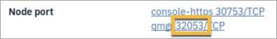
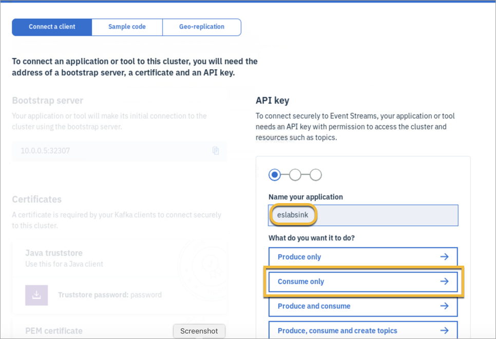
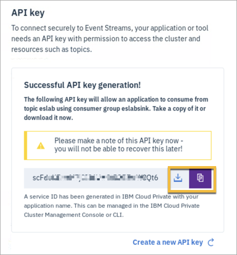

# Lab 5: Use Kafka Connect sink connector for IBM MQ

**Duration:** 1 hour

In this exercise, you connect IBM Event Streams to IBM MQ by using the Kafka Connect sink connector for IBM MQ. You can use this connector to transfer messages from an Event Streams or Kafka Topic to an MQ queue.  

In the previous lab exercise, you installed MQ and configured the Kafka Connect source connector, which takes messages from an MQ queue and transfers them to a Topic in Event Streams. In this exercise, you use the same MQ queue manager that you configured previously, and test the sink connector by using the eslabtester application that you used before.

You must complete Labs 1-4 before proceeding with this lab. 


## Step 1. Install the connector

1. Open the Event Streams console.

 HINT: To access the Event Streams admin console, in the IBM Cloud Private console, select **Workloads > Helm Releases** from the console menu, click **eslab**, and then click **Launch** in the upper right corner, and select **admin-ui-https**.
 
2. Click **Toolbox** and scroll down to **Connectors**.

3. Under **Kafka Connect sink connector for IBM MQ**, click **Find out more**.

 

4. Click the links to download the **Connector JAR** and **Sample connector properties** file, and click **Save file**.

 

 NOTE: You can also obtain the connector from [GitHub](https://github.com/ibm-messaging/kafka-connect-mq-sink) if you want to build it yourself. 

5. Copy the files into `/home/student`.

## Step 2. Configure the connector

REMINDER: There are two configuration files: the worker configuration file contains the properties that are required to connect to Kafka, and the connector configuration file contains the properties that are used by the connector, so that is where the MQ configuration goes.

As you did in a previous exercise, you must create a new API key for the consumer application. 

### A. Update sink connector properties

1. In a command terminal window, change to `/home/student` and open the `mq-sink.properties` file in an editor:

 ```
 cd /home/student
 gedit mq-sink.properties
 ```
2. Update the properties as follows:

 * `topic=eslab`
 * `mq.queue.manager=QM1`
 * `mq.connection.name.list=10.0.0.1(port)`
 * `mq.channel.name=DEV.APP.SVRCONN`
 * `mq.queue=DEV.QUEUE.2`

 In this case, the target queue is DEV.QUEUE.2. 

 NOTE: For the `port`, use your MQ listener port, which is displayed in the IBM Cloud Private console under **Network Access > Services > mymq-ibm-mq**.
 
   
 
 The number might be different than the one shown here.

   

3. Save and close the file.

### B. Create an API key for the consumer application 

1. In the Event Streams console, select **Topics > eslab > Connect to this topic**.

   

2. Under **API key**, enter a name in **Name your application**, for example, **eslabsink**, and click **Consume only**.

 

3. Enter **eslab** for **Which topic?**, and click **Next**.

  
 
4. Enter **eslabsink** for the **Which consumer group?**, and click **Generate API key**.

 
 
6. Click the button to either copy the key to the clipboard, or save it to a file. 

 

 
### C. Update worker properties

1. In the Kafka root `config` directory, make a copy of the `mqlab.properties` file, and name it `connect-standalone-sink.properties`.

 ```
 cd /home/student/Downloads/kafka_2.12-2.2.0/config
 gedit connect.standalone-sink.properties
 ```
 
2. In the text editor menu, select **File > Save As**, edit the name of the file, and click **Save**.

3. Replace the consumer API keys with the one you just generated. 

4. Add the following line after the `security` and `consumer` code stanzas:

 `consumer.group.id=eslabsink`
 
 NOTE: The file should still contain your bootstrap server address and port, from the previous lab exercise. 
 
   
 
5. Save and close the file.

## Step 3. Test the sink connector

1. In a command terminal window, change to the Kafka root directory, and run the following command to start the connector:

 `CLASSPATH=/home/student/kafka-connect-mq-sink-1.0.1-jar-with-dependencies.jar bin/connect-standalone.sh config/connect-standalone-sink.properties /home/student/mq-sink.properties`
 
 The connector starts, establishes a connection to the MQ queue manager, and starts listening for messages on topic eslab. Look for the message "Connection to MQ established," in the output.
 
2. Run the eslabtester starter application again. If it is not already open, in a new browser tab, enter the following URL:

	`http://localhost:9080/elabtester`

 HINT: If you need to run the starter application again, in a command terminal, change to the `/home/student/Downloads` directory and enter the following commands:

 ```
cd /home/student/Downloads
export _JAVA_OPTIONS=-Djdk.net.URLClassPath.disableClassPathURLCheck=true
mvn install liberty:run-server
```

 Wait until you see the message, "The server defaultServer is ready to run a smarter planet" before you proceed to the next step.
	
3. In the eslabtester application, click the arrow to start producing messages. 

   

4. After the number of messages begins to increase, check the MQ console. Click the refresh icon for **Queues on QM1**.

   
 
 The **Queue depth** for **DEV.QUEUE.2** increases as the number of messages increases.
 
    

5. In the eslabtester application, click the run button again to stop producing messages.

6. Check the MQ console again to verify that the messages were received. 

7. Stop the connector and eslabtester application by pressing Ctrl-C in each terminal window. 

### End of exercise

## End of Lab