# Lab 6: Monitoring Event Streams with IBM Cloud Private

**Duration:** 20 minutes

The Event Streams console provides monitoring capabilities from a Kafka perspective. IBM Cloud Private includes the ELK (Elasticsearch, Logstash, and Kibana) stack, which provides an extensive monitoring and logging framework. 

In this exercise, you explore some of those capabilities. This lab is only intended to provide a brief introduction to the tools. For more information, visit the [IBM Cloud Private Knowledge Center](https://www.ibm.com/support/knowledgecenter/en/SSBS6K_3.1.1/manage_metrics/logging_elk.html).

## Step 1. Explore the Grafana dashboard

Grafana is an open platform for analytics and monitoring that is included with IBM Cloud Private. In this part of the exercise, you explore the Grafana dashboard for Event Streams. You can use this dashboard to explore Kafka metrics for your Event Streams applications. 

1. Get the Grafana dashboard for Event Streams from GitHub. 

 `https://github.com/IBM/charts/blob/master/stable/ibm-eventstreams-dev/ibm_cloud_pak/pak_extensions/dashboards/ibm-eventstreams-grafanadashboard.json`
 
2. Copy the contents of the file to the clipboard. 
 
3. In the IBM Cloud Private console, select **Platform > Monitoring** from the menu.

 The Grafana dashboard opens in another browser tab.
 
4. In the Grafana dashboard, click **+** (Create) and select **Import**.

5. Paste the code into the **Or paste JSON** field, and click **Load**.

 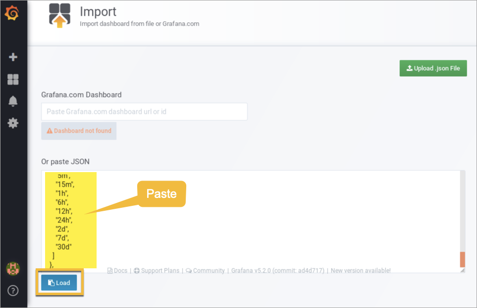
 
6. Click **Import**.

 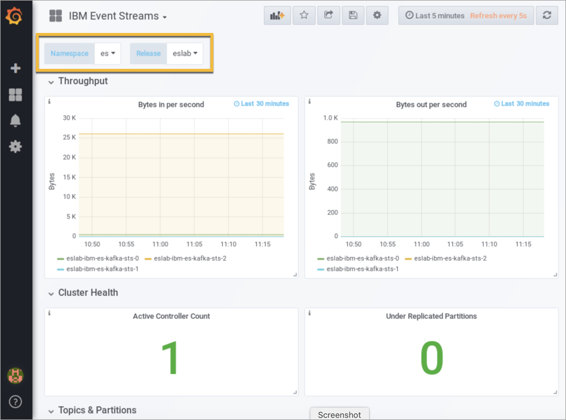
 
 The **IBM Event Streams** dashboard displays. Make sure that the **es** namespace and **eslab** release are selected. Feel free to explore the dashboard. You can customize the information that you see in this dashboard. 
 
7. Click **Add Panel** at the top of the page.

 

8. Click **Graph**.

 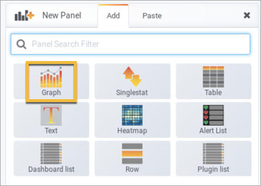

 A new empty panel displays. 
 
9. Click the title of the new panel and select **Edit**.

10. In the first query field that opens, start typing "kafka" and a list of Kafka metrics is displayed in a drop-down menu. 

 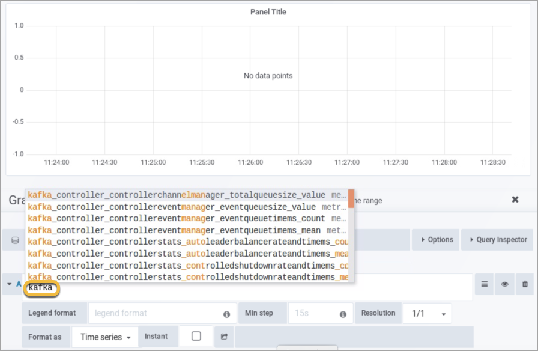

11. Select the metric shown here, and click the return arrow in the upper right corner to view it in the panel. 

 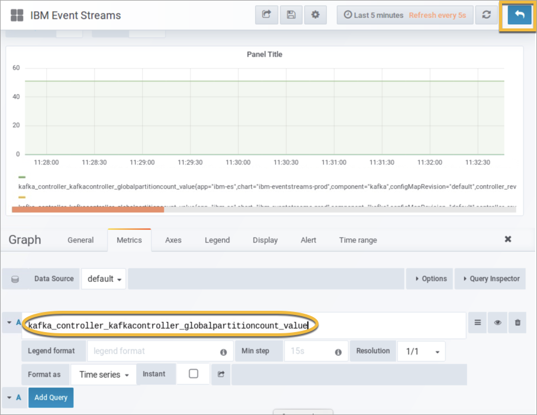
 
12. Click the **General** tab, enter a name for the panel, and then click the return arrow again.

 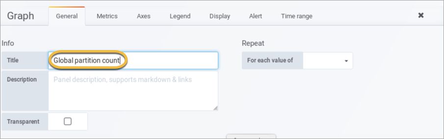

 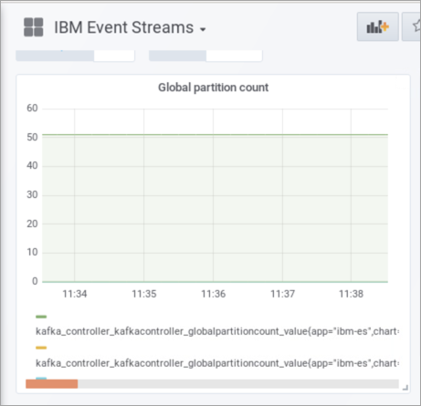
 
13. Continue to explore the Grafana interface. When finished, close the Grafana browser tab. 

## Step 2. View logs in Kibana

Kibana is an open source data visualization plugin for Elasticsearch, and is included in IBM Cloud Private. You can use it to view log data in various graphical forms. 

If you view a component in the IBM Cloud Private console and select a link within that context, the console displays log data for that particular component. Otherwise, you can build your own queries in the Kibana Discover dashboard. 

### A. View logs for a specific component

In this example, you view log data for a specific pod (container) in Event Streams.

1. In the IBM Cloud Private console, select **Workloads > Helm Releases > eslab**.

2. Scroll down to the list of pods and click the **View logs** link for any one of the pods.

 The Kibana Discover dashbaord opens in a new browser tab. If it says there is no data to display, close the tab, and choose a different pod from the list. 
 
 NOTE: An index pattern, **logstash-\***, was already configured for Kibana in your lab environment. The index pattern tells Kibana what Elasticsearch indices to run against. If this was the first time Kibana was accessed, you would be prompted to set up an index pattern. Kibana requires at least one index pattern to be set up. 
 
3. Click the time range selector tab.

 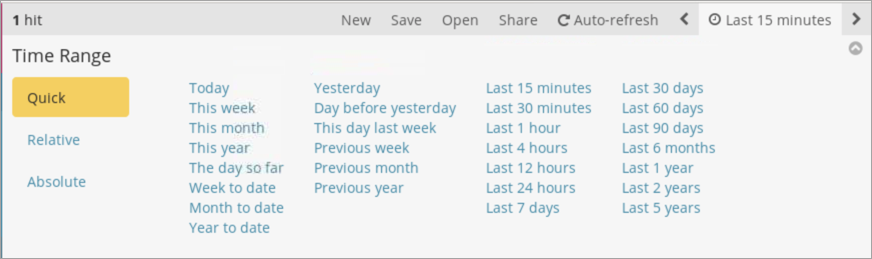

 Here, you can select the time range of data to display. Click the tab again to close it.
 
4. Click the arrow next to a log entry to expand it.

 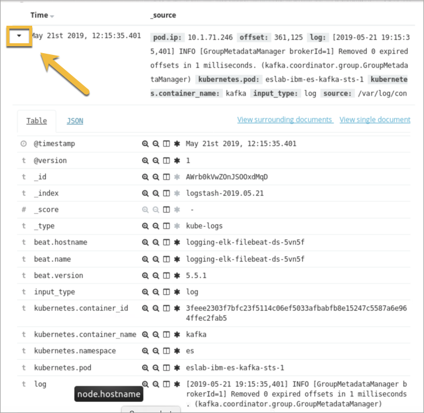

 The fields for the log entry are shown. These fields can be used in a search filter expression to reduce the returned data, or to search for
specific entries. The log information is derived from the stdout or stderr stream. 

5. To filter the output according to stream, click **Add a filter**.

 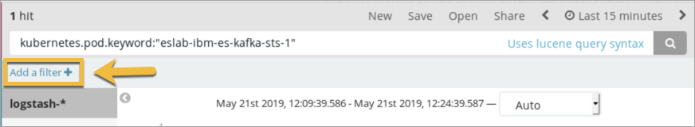
 
6. Under **Filter**, select **stream > is**, enter **stderr** in the field, and click **Save**.

 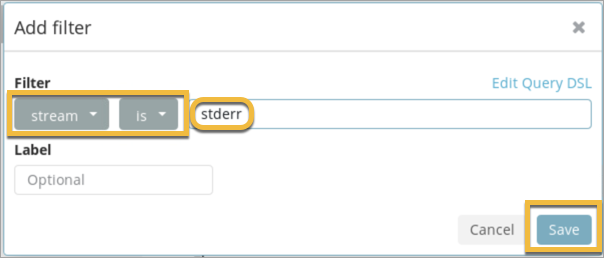

 The results, if any, are displayed. Feel free to experiment by adding different filters. When finished, close the Kibana browser tab. 

### B. Build a custom query

In this example, you build a custom log query by using the Kibana interface. 

1. In the IBM Cloud Private console, select **Platform > Logging** from the menu.

 Kibana opens in a new browser tab. In this case, it displays all the log data that is available. 

2. In the list of **Available fields**, click any field. For example, click **stream**.

 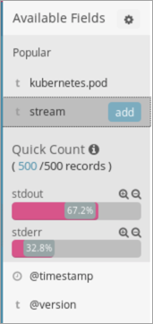

 Details about how records are distributed between the two streams are shown. Feel free to explore the available fields. If you click **Add** next to a field in the list, Kibana sorts the data according to that field. 

3. Build a filter expression based on one or more fields of your choice to reduce the returned data. For example, try adding the filter for stderr, as you did in a previous step. 

4. When you are finished exploring the Kibana interface, close the browser tab.

## Step 3. Metering

1. In the IBM Cloud Private console, select **Platform > Metering** from the menu.

 The metering groups display.
 
2. Under Groups, select **Workloads > es**.

3. In the middle column, enter "kafka" in the search field to see a list of Event Streams Kafka containers.

 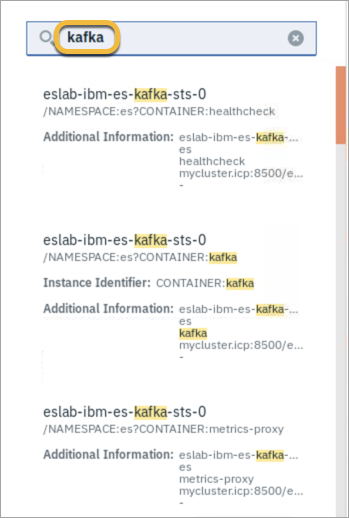

4. Click a container to view usage details in the column on the right. 

 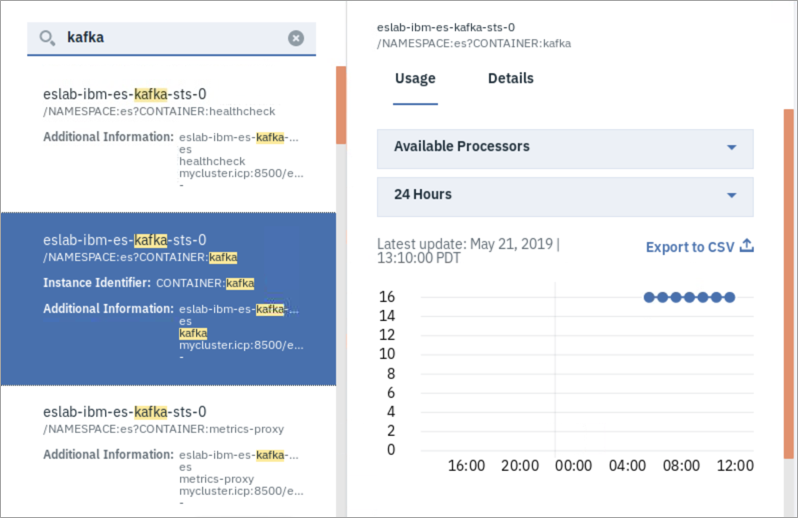
 
 NOTE: You can export this information by clicking the **Export to CSV**.

5. Click **Details** to view information about the deployed configuration (Software) and operating system (Environment).

 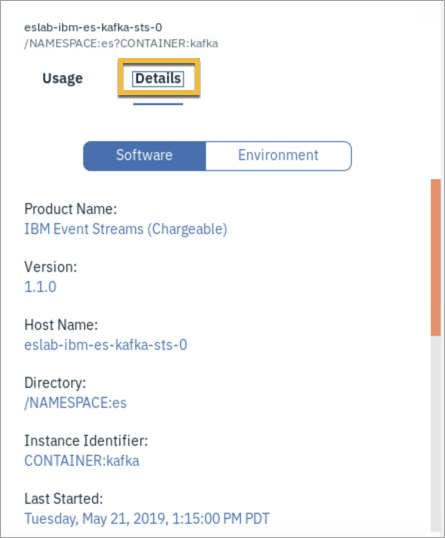

 NOTE: To obtain a full report, you can click **Download Report** in the upper right corner. 
 
6. When you are finished exploring, you can close the browser.

### End of exercise